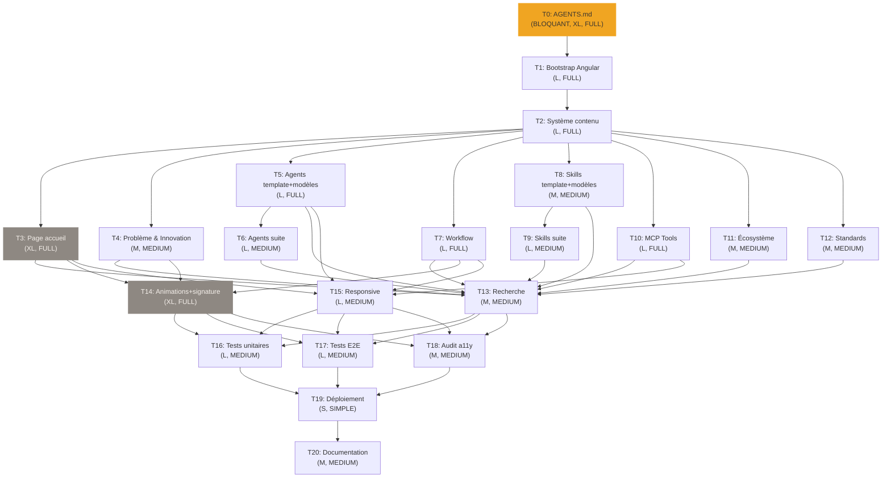

# PLAN.md — Swarm Wiki Implementation Plan

## Métadonnées

- **Projet** : Swarm Wiki
- **Date** : 5 juin 2026
- **Version** : 1.0
- **Stack** : Angular (frontend statique, pas de backend)
- **Durée totale estimée** : 15–25 jours calendaires (parallélisation swarm) / ~30–38 jours-homme (séquentiel)
- **Résumé** : Wiki vitrine du système Swarm — application Angular 100% statique, dark mode exclusif, palette #3A3530 / #8E8882 / #F0A522. Cible recruteurs, tech leads et managers. 20 tâches optimisées pour exécution parallèle par la swarm.

---

## Tâche 0 — Réécriture AGENTS.md 🔒 BLOQUANTE

**Complexité** : FULL
**Durée** : XL (3–5 jours)
**Dépendances** : Aucune
**Parallélisable** : Non (bloque tout)

### Description

Produire un `AGENTS.md` de 300–400 lignes qui servira de bible au projet Swarm Wiki. Analyse de l'existant (Next.js/FastAPI), décisions techniques avec recommandations, philosophie UX/UI complète. Aucun code produit.

### Livrables de la tâche 0

#### 0.1 — Audit du AGENTS.md existant

| Section existante | Action | Justification |
|---|---|---|
| §1 Stack Technique (Next.js/FastAPI) | **Réécrire** | Stack Angular statique uniquement |
| §2 Protocole Comportemental | **Conserver** | Framework-agnostique, fondamental |
| §3 Philosophie Projet | **Conserver + adapter** | Triple rôle valide, adapter contexte wiki |
| §4 Standards Apple-Grade | **Conserver + adapter** | Noyau dur à garder, adapter dark mode + wiki |
| §5 Directives par Agent | **Réécrire** | Remplacer React/FastAPI par Angular statique |
| §6 Principes Fondamentaux de Décision | **Conserver** | Universel |
| §7 Standards de Rédaction In-App | **Conserver + adapter** | Adapter pour wiki technique (pas SaaS) |
| §8 Standards Techniques | **Conserver + adapter** | Remplacer patterns React par patterns Angular |
| §9 Processus de Génération | **Conserver** | Valable pour tout projet |
| §10 Ce que tu ne fais jamais | **Conserver** | Universel |
| §11 Checklist de Livraison | **Conserver + adapter** | Adapter critères pour wiki statique |

**À AJOUTER** :
- Palette 6 couleurs en CSS custom properties
- Règle dark-mode-only explicite
- Stratégie contenu statique (Option C — Hybride)
- Standards de rédaction wiki (ton technique accessible)

**À SUPPRIMER** :
- Next.js, React, Radix UI, CVA, Zustand, Framer Motion
- FastAPI, Python, uvicorn, Supabase, Stripe, Resend, Gemini
- Sections "conversion funnel", "landing page SaaS", "paiements"

#### 0.2 — Décisions techniques (avec recommandations)

##### Frontend

| ID | Décision | Options | Recommandation |
|---|---|---|---|
| F1 | Version Angular | 18 vs 19 | **Angular 19** — dernière version stable, standalone components matures, pas de raison de démarrer sur une ancienne version pour un greenfield. `[DÉCISION_UTILISATEUR]` |
| F2 | CSS | Tailwind v4 vs SCSS vs les deux | **Tailwind v4 + SCSS**. Tailwind pour le utility-first rapide (layout, spacing, typographie), SCSS pour les animations complexes, keyframes custom, et design tokens programmatiques. `[DÉCISION_UTILISATEUR]` |
| F3 | Composants UI | Custom pur vs CDK vs les deux | **Angular CDK uniquement**. Primitives headless pour a11y (focus trap, keyboard nav, overlays) sans imposer de style. Tout le rendu visuel est custom Apple-grade. `[DÉCISION_UTILISATEUR]` |
| F4 | State management | Signals+Services vs NgRx vs NGXS | **Signals + Services natifs**. Wiki statique = état minimal (page courante, sidebar, recherche). Signals pour réactivité, services pour logique. Pas de overhead NgRx. `[DÉCISION_UTILISATEUR]` |
| F5 | Animations | @angular/animations vs GSAP vs Motion One | **GSAP**. Scroll-triggered animations, timelines complexes, stagger sequences, parallaxe, SVG path — tout ce que l'Apple-grade exige. @angular/animations gère le basique, GSAP le premium. `[DÉCISION_UTILISATEUR]` |
| F6 | Tests unitaires | Jasmine+Karma vs Jest | **Jest**. Plus rapide (pas de navigateur), snapshots, watch mode efficace, compatible Angular via @angular-builders/jest. `[DÉCISION_UTILISATEUR]` |
| F7 | Tests E2E | Playwright vs Cypress | **Playwright**. Déjà intégré swarm via MCP, cross-browser, auto-waiting, visual comparisons, trace viewer. `[DÉCISION_UTILISATEUR]` |
| F8 | Markdown | ngx-markdown vs marked.js vs markdown-it | **ngx-markdown**. Wrapper Angular mature pour marked.js, plugins, custom renderers, intégration Prism.js native. `[DÉCISION_UTILISATEUR]` |
| F9 | Coloration syntaxe | Prism.js vs Shiki vs highlight.js | **Prism.js**. Léger (~1.5KB par langage), thème dark customisable palette, intégré ngx-markdown. Shiki plus précis mais plus lourd (grammaires TextMate). `[DÉCISION_UTILISATEUR]` |
| F10 | Diagrammes | Mermaid.js vs D3.js vs Cytoscape.js | **Mermaid.js + D3.js**. Mermaid pour les diagrammes Markdown standard. D3.js exclusivement pour la carte interactive de la homepage (élément signature). `[DÉCISION_UTILISATEUR]` |
| F11 | Recherche | Fuse.js vs lunr.js vs custom | **Fuse.js**. Fuzzy search client-side, pas d'index à construire, configuration simple. Volume modéré (centaines de pages, pas millions). `[DÉCISION_UTILISATEUR]` |

##### Transverses

| ID | Décision | Options | Recommandation |
|---|---|---|---|
| C1 | Stratégie contenu | Markdown pur (A) vs Composants purs (B) vs Hybride (C) | **Hybride (Option C)**. Pages à fort impact visuel (accueil, architecture, workflow) = composants purs pour contrôle Apple-grade total. Pages de référence (agents, skills, tools individuels) = Markdown pour cohérence et maintenabilité. Un template Markdown riche (composants Angular embarqués) fait le pont. `[DÉCISION_UTILISATEUR]` |
| C2 | Structure repo | Monorepo simple vs sous-dossiers complexes | **Monorepo standard Angular CLI**. `src/app/features/` pour les sections, `src/content/` pour les fichiers Markdown. Pas de workspace Nx. `[DÉCISION_UTILISATEUR]` |
| C3 | Déploiement | Vercel vs Render static vs GitHub Pages | **Vercel**. MCP natif disponible, CDN global, déploiement Git auto, SSL, analytics. Optimisé pour les static sites. `[DÉCISION_UTILISATEUR]` |
| C4 | CI/CD | GitHub Actions vs manuel | **GitHub Actions**. Intégré au workflow swarm (création auto de workflows). Pipeline: lint → test → build → deploy sur merge main. `[DÉCISION_UTILISATEUR]` |
| C5 | Routing | Lazy loading vs eager | **Lazy loading par feature**. Chaque section (agents, skills, tools, workflow) chargée à la demande via `loadChildren`. Layout shell et homepage chargés eagerly. `[DÉCISION_UTILISATEUR]` |
| C6 | i18n | FR uniquement vs i18n-ready | **Français uniquement (v1)**. Pas de complexité i18n pour v1. Si besoin, @angular/localize est disponible. `[DÉCISION_UTILISATEUR]` |

#### 0.3 — Philosophie UX/UI (dark mode exclusif)

**Direction esthétique : Dark Technologique Raffiné**

Cohérence absolue avec le sujet (système d'agents IA). Lueurs ambrées (#F0A522) sur fond brun profond (#3A3530) créent une atmosphère de "centre de contrôle" sophistiqué — sérieux sans froideur, technique sans austérité. Recruteurs = qualité premium perçue. Ingénieurs = confort de lecture dark mode longue durée. Pas de "mode nuit" gadget — c'est l'identité native du produit.

`[DÉCISION_UTILISATEUR]`

**Pairing typographique : Cabinet Grotesk (display) + Satoshi (body)**

- **Cabinet Grotesk** (Bold, Extrabold) → H1, H2, labels navigation. Personnalité affirmée, tracking serré, fonctionne en grandes tailles comme élément graphique à part entière.
- **Satoshi** (Regular, Medium) → paragraphes, code, tableaux. Géométrique et élégante, optimisée lecture écran longue durée, excellent pairing avec Cabinet Grotesk.
- **Gratuites** (Fontshare) — pas de licence, pas de coût, chargement optimisé.
- **INTERDIT** : Inter, Roboto, Open Sans, Lato, Montserrat, Poppins.

`[DÉCISION_UTILISATEUR]`

**Système spatial : base 8px**

Échelle : 4, 8, 12, 16, 24, 32, 48, 64, 96, 128px. Contenus longs : padding horizontal 80–120px desktop, 24px mobile. Espace négatif généreux entre sections.

**Système d'élévation dark (glow borders, pas d'ombres)**

Les ombres classiques sont invisibles sur fond #3A3530. Remplacées par un système de bordures lumineuses et contrastes de surface :

- **N1 (page)** : fond `#3A3530`
- **N2 (carte)** : fond `#4A4540`, border `1px rgba(142,136,130, 0.12)`
- **N3 (carte surélevée)** : fond `#4A4540`, border `1px rgba(142,136,130, 0.2)`, box-shadow `0 0 20px rgba(240,165,34, 0.04)`
- **N4 (modale/overlay)** : fond `#4A4540`, border `1px rgba(142,136,130, 0.3)`, box-shadow `0 0 40px rgba(240,165,34, 0.06)`, backdrop-filter `blur(12px)`

**Vocabulaire d'animation**

| Contexte | Propriétés | Durée | Easing |
|---|---|---|---|
| Transition de page | fade + translateY(8px→0) | 400ms | cubic-bezier(0.22,1,0.36,1) |
| Navigation (hover) | color + scale(1.02) | 200ms | ease-out |
| Stagger contenu | fade + translateY(16px→0) | 80ms/item | ease-out |
| Hover carte | translateY(-2px) + glow | 250ms | cubic-bezier(0.25,0.46,0.45,0.94) |
| Active (press) | scale(0.97) | 100ms | ease-in-out |
| Scroll décoratif | parallaxe, sticky | continu | linear |

**Élément signature : grille hexagonale animée**

Hexagones interconnectés (métaphore de la ruche = swarm) en arrière-plan. Pulsation lente (opacité 0.03–0.06), certains s'illuminent en #F0A522 au scroll ou au survol. Chaque hexagone = un agent, connecté aux autres. Implémentation SVG/Canvas pour performance.

`[DÉCISION_UTILISATEUR]`

**Navigation**

- **Sidebar** : arborescence pliable, largeur 280px desktop, fond #3A3530, recherche intégrée
- **Breadcrumbs** : permanents en haut, séparateur `/`, chaque segment cliquable
- **TOC** : sticky colonne droite 220px desktop, accordéon haut de page mobile
- **Recherche rapide** : modal Cmd+K / Ctrl+K, résultats instantanés Fuse.js
- **Pages connexes** : 3 liens max en bas de chaque article

**Mobile**

- Sidebar → slide-over gauche avec overlay semi-transparent
- TOC → accordéon pliable en haut de page
- Polices via `clamp()` — pas de breakpoints, fluid design
- Touch targets ≥ 44×44px (Apple HIG)

**Motifs INTERDITS**

- Light mode (aucune forme, pas de toggle, pas de media query)
- Hero sections avec gradient
- Grilles de cards identiques
- Esthétique SaaS/blog template
- Inter / Roboto / Open Sans
- Violet / bleu / indigo (n'importe où)
- Composants Material ou shadcn non reskinnés
- Lorem ipsum

#### 0.4 — Critères DONE tâche 0

- [ ] Audit exhaustif de l'AGENTS.md existant documenté
- [ ] Toutes les décisions F1–F11 et C1–C6 présentées avec recommandations + `[DÉCISION_UTILISATEUR]`
- [ ] Philosophie UX/UI complète (direction, typo, spatial, élévation, animation, signature, nav)
- [ ] Palette 6 couleurs documentée en CSS custom properties
- [ ] AGENTS.md final structuré en 10 sections, 300–400 lignes
- [ ] Aucun contenu Next.js/FastAPI/Supabase résiduel

---

## Tâches 1..20 — Implémentation

| ID | Titre | Description | Dépendances | Complexité | Durée | Parallélisable |
|---|---|---|---|---|---|---|
| **T1** | Bootstrap Angular + thème dark | `ng new`, config Tailwind v4 + SCSS, palette CSS custom properties, thème dark global, routing lazy-load, layout shell (sidebar vide, breadcrumbs, TOC placeholder, header), polices Cabinet Grotesk + Satoshi chargées | T0 | **FULL** | L | Non (après T0) |
| **T2** | Système de contenu statique | Service de chargement Markdown, composant renderer avec template riche (support callouts, code blocks, diagrammes Mermaid, tableaux), intégration Prism.js thème dark custom, composant TOC dynamique (généré depuis les headings Markdown), système de métadonnées frontmatter | T1 | **FULL** | L | Non (dépend de T1) |
| **T3** | Page d'accueil | Carte interactive du système Swarm (D3.js : graphe de nœuds agents avec connexions animées, zoom/pan, tooltips au survol), résumé exécutif (elevator pitch 3 phrases), statistiques clés (9 agents, 26 skills, 4 catégories MCP), tagline, navigation visuelle vers sections principales. **Wow moment :** animation d'entrée du graphe — les nœuds apparaissent en stagger et les connexions se tracent progressivement | T2 | **FULL** | XL | Oui ∥ T4–T12 |
| **T4** | Page Problème & Innovation | Avant/Après (développement sans swarm vs avec), comparaison tableaux assistants mono-agents vs Swarm, 7 piliers d'innovation détaillés, témoignages/cas d'usage, section "Pour qui". Composant pur (Option B). **Wow moment :** compteur animé de réduction de temps, barres de comparaison qui s'animent au scroll | T2 | **MEDIUM** | M | Oui ∥ T3,T5–T12 |
| **T5** | Pages Agents — template + modèles | Page listing agents (grille asymétrique, carte par agent avec rôle+icône), template page détail (structure fixe : rôle, responsabilités, contraintes, outils, routes, exemple), 2 agents complets rédigés (orchestrateur + front). Composants purs pour le listing. **Wow moment :** animation de pipeline sur la fiche agent montrant sa position dans le flux | T2 | **FULL** | L | Oui ∥ T3,T4,T7–T12 |
| **T6** | Pages Agents — suite | Rédaction des 7 agents restants (search, planner, contract, back, tester, reviewer, writer). Contenu Markdown injecté dans le template. 7 fichiers .md dans `src/content/agents/` | T5 | **MEDIUM** | L | Oui ∥ T3,T4,T7–T12 (indép. si T5 fini) |
| **T7** | Pages Workflow | Arbre de décision interactif des routes (DIRECT→SIMPLE→ADAPT→MEDIUM→FULL), diagramme Mermaid du pipeline complet, explication détaillée pré-search, gates qualité (tester, reviewer), intégration Git (issues→branches→PR→merge), files et mémoire (.swarm-queue.json, .agent-memory.json). Composant pur. **Wow moment :** diagramme de pipeline animé — chaque étape se highlight au scroll | T2 | **FULL** | L | Oui ∥ T3–T6,T8–T12 |
| **T8** | Pages Skills — template + modèles | Page catalogue skills (grille avec filtres par catégorie), template page détail, 3 skills modèles rédigés (ui-ux-pro-max, tests-create, graphify). Markdown pour le contenu, composant pour le listing. **Wow moment :** animation d'icône SVG par skill au survol | T2 | **MEDIUM** | M | Oui ∥ T3–T7,T9–T12 |
| **T9** | Pages Skills — suite | Rédaction des 23 skills restants. Fichiers .md dans `src/content/skills/`. Contenu standardisé (description, cas d'usage, déclencheurs, entrées/sorties, exemple) | T8 | **MEDIUM** | L | Oui ∥ T3–T7,T10–T12 (indép. si T8 fini) |
| **T10** | Pages MCP Tools | 4 pages (supabase, vercel, render, playwright) — chaque page liste tous les outils de la catégorie avec paramètres, description, exemple d'utilisation. Composant pur + Markdown hybride. **Wow moment :** simulation de paramètres interactifs — l'utilisateur peut "essayer" les paramètres dans un playground visuel | T2 | **FULL** | L | Oui ∥ T3–T9,T11–T12 |
| **T11** | Page Écosystème | Structure .opencode/ (arborescence expliquée), swarm-workflow.json (décortiqué champ par champ), AGENTS.md (rôle et structure), intégration IDE, diagramme d'architecture global. Composant pur partiel + Markdown | T2 | **MEDIUM** | M | Oui ∥ T3–T10,T12 |
| **T12** | Page Standards | Standards Apple-grade (typo, couleurs, animations), conventions de code, philosophie de test, processus de documentation. Contenu principalement Markdown | T2 | **MEDIUM** | M | Oui ∥ T3–T11 |
| **T13** | Recherche | Modal Cmd+K / Ctrl+K (overlay avec input centré), intégration Fuse.js, indexation du contenu Markdown + pages composants, résultats en temps réel avec navigation clavier, highlight des termes matchés, section "pages suggérées" sans requête. **Wow moment :** animation d'ouverture fluide + résultats qui apparaissent en stagger | T3–T12 | **MEDIUM** | M | Non (dépend du contenu) |
| **T14** | Animations globales + signature | GSAP : transitions de page (fade+slide), stagger sur toutes les listes, scroll-triggered reveal pour chaque section, animations hover premium sur cartes et liens, parallaxe multi-vitesses sur éléments décoratifs. Grille hexagonale : SVG/Canvas rendering avec pulsation et illumination interactive. Easings custom, respect `prefers-reduced-motion`. **Wow moment :** la grille hexagonale pulse au rythme du scroll — chaque section visitée active un cluster d'hexagones | T3–T12 | **FULL** | XL | Non (dépend du contenu) |
| **T15** | Responsive mobile | Adaptation de TOUTES les pages : sidebar→slide-over, TOC→accordéon, grilles→stack vertical, polices clamp(), tableaux→scroll horizontal, diagrammes→zoomables, carte interactive→version simplifiée. Touch targets ≥44px partout. Tests sur iPhone 14 + iPad (Playwright devices) | T3–T12 | **MEDIUM** | L | Non (dépend du contenu) |
| **T16** | Tests unitaires | Jest : services (Markdown loader, search, routing), composants critiques (layout, sidebar, Markdown renderer, TOC, search modal), pipes, directives. Tests d'états (loading, empty, error, success). Coverage ≥80% | T13,T14,T15 | **MEDIUM** | L | Oui ∥ T17,T18 |
| **T17** | Tests E2E Playwright | Scénarios critiques : navigation complète (toutes les sections), recherche (Cmd+K → résultat → navigation), rendu Markdown (vérifier contenu correct), responsive (mobile + desktop viewports), performance (Lighthouse ≥90), snapshots visuels des pages clés. Exécution via `mcp-playwright.sh` | T13,T14,T15 | **MEDIUM** | L | Oui ∥ T16,T18 |
| **T18** | Audit accessibilité | WCAG AA : contrastes vérifiés (tous ≥4.5:1), navigation clavier complète (Tab, Enter, Escape, flèches), labels ARIA sur composants interactifs, structure sémantique HTML5, test lecteur d'écran (VoiceOver), focus visible, skip-to-content link. Rapport d'audit + correctifs | T13,T14,T15 | **MEDIUM** | M | Oui ∥ T16,T17 |
| **T19** | Déploiement | Configuration Vercel (build command: `ng build`, output dir: `dist/swarm-wiki/browser`), variables d'environnement, domaine personnalisé (?), `vercel.json` avec rewrites SPA. Déploiement via MCP Vercel natif. Vérification post-déploiement (pages accessibles, assets chargés, pas de 404 SPA) | T16,T17,T18 | **SIMPLE** | S | Non (après qualité) |
| **T20** | Documentation | README.md (présentation, stack, setup local, commandes), ARCHITECTURE.md (décisions, structure, flux de données, diagrammes), CHANGELOG.md (v1.0.0), mise à jour éventuelle du AGENTS.md si dérive. Généré par l'agent writer | T19 | **MEDIUM** | M | Non (après déploiement) |

---

## Graphe de dépendances



**Phases parallélisables :**

```
Phase SOCLE (séquentiel strict)
  T0 → T1 → T2 ................................. ~7–9j

Phase CONTENU (parallèle massif)
  T3 ∥ T4 ∥ T5 ∥ T7 ∥ T8 ∥ T10 ∥ T11 ∥ T12 .... ~3–5j (la + longue: T3 XL)
  T6 (après T5) ∥ T9 (après T8) ................ dans la même fenêtre

Phase POLISH (parallèle)
  T13 ∥ T14 ∥ T15 ............................... ~3–5j (la + longue: T14 XL)

Phase QUALITÉ (parallèle)
  T16 ∥ T17 ∥ T18 ............................... ~1–2j

Phase LIVRAISON (séquentiel)
  T19 → T20 ..................................... ~1j
```

**Total calendaire estimé : 15–22 jours** (grâce au parallélisme massif de la phase CONTENU)

---

## Évaluation des risques

| # | Risque | Probabilité | Impact | Mitigation |
|---|---|---|---|---|
| 1 | **Sous-estimation du contenu** — 9 agents + 26 skills + 4 catégories MCP = volume rédactionnel énorme. La qualité Apple-grade exige du contenu réel, pas du placeholder. | Élevée | Retard 5–10j | T5/T6 et T8/T9 déjà découpées en template+échantillon puis remplissage. Pré-rédiger le contenu en amont (hors swarm) ou accepter un remplissage progressif post-V1. |
| 2 | **D3.js sur la homepage** — la carte interactive (T3) est le poste technique le plus risqué. D3 a une courbe d'apprentissage raide, l'intégration Angular+D3 est délicate (conflit de manipulation DOM). | Moyenne | Retard 3–5j sur T3 | Prototyper la carte D3 en dehors d'Angular d'abord. Utiliser `ngx-d3` ou une approche "D3 pour les calculs, Angular pour le rendu" (moins risqué que D3 manipulant le DOM directement). |
| 3 | **Performance avec animations lourdes** — GSAP + D3 + grille hexagonale Canvas + Markdown renderer = risque de jank, surtout sur mobile. Lighthouse ≥90 menacé. | Moyenne | Retard 2–3j sur T14/T15 | Benchmarker tôt. Lazy-load GSAP et D3. Réduire les animations sur mobile (`prefers-reduced-motion`). Utiliser `will-change` et `transform: translateZ(0)` avec parcimonie. Canvas pour la grille (pas de DOM par hexagone). |

---

## Synthèse pour la swarm

- **20 tâches**, dont 1 bloquante (T0)
- **Phase CONTENU** : 10 tâches (T3–T12) **toutes parallélisables entre elles** → la swarm peut lancer jusqu'à 10 agents front simultanément
- **Complexité mixte** : 6 FULL, 12 MEDIUM, 1 SIMPLE, 1 ADAPT — la swarm a toutes les routes nécessaires
- **3 tâches XL** (T0, T3, T14) qui nécessiteront le pipeline FULL (planner→contract→front→tester→reviewer)
- **Aucun backend** — tous les agents back sont inactifs sur ce projet, toute la puissance swarm est concentrée sur le front
- **Les agents ne sont pas prescrits** dans le plan — l'orchestrateur classifie et route selon la complexité de chaque tâche
- **Points de décision utilisateur** : 17 `[DÉCISION_UTILISATEUR]` dans T0 — nécessitent validation avant toute implémentation
